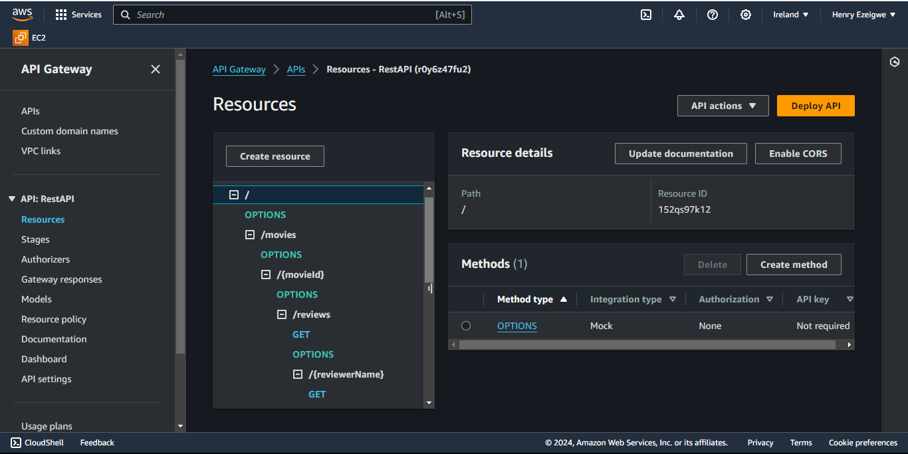
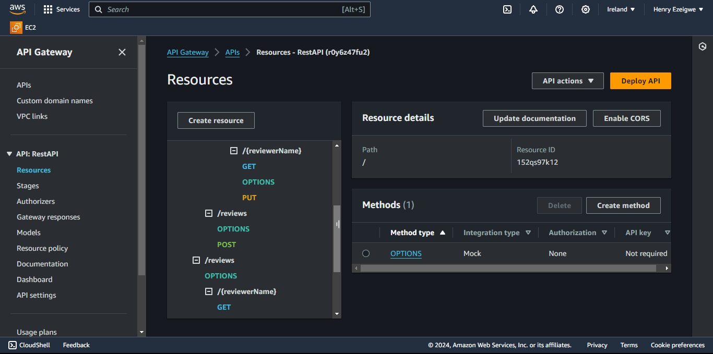
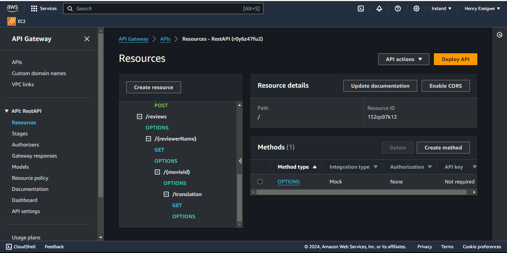
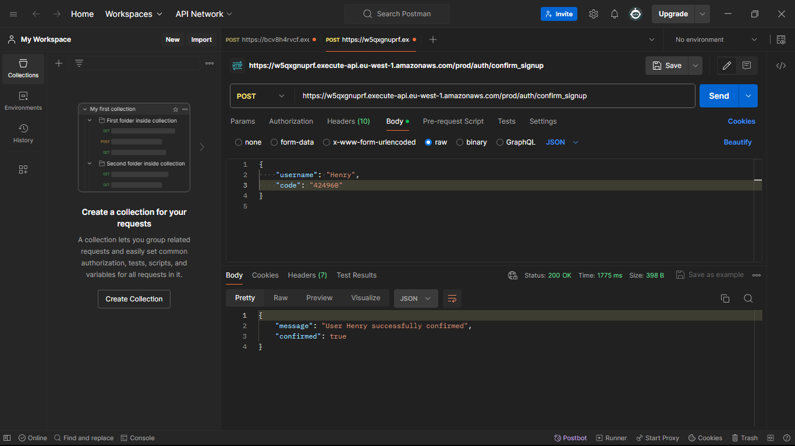
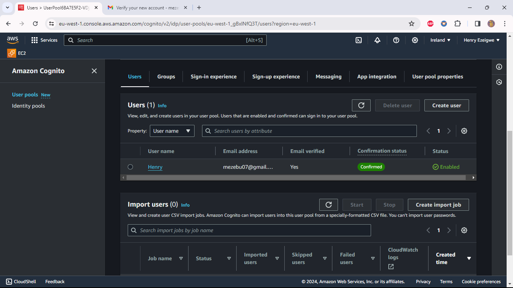

## Serverless REST Assignment.

**Name:** Uchechukwu Henry Ezeigwe

**Video demonstration:**

[URL of my Youtube video demonstration](https://www.youtube.com/watch?v=Fyxg0GJGW1A)

This repository contains an implementation of a serverless REST API for the AWS platform. The CDK framework is used to provision its infrastructure. The API's domain context is movie reviews.

### API endpoints.

- `POST /movies/reviews`
  - Description: Add a movie review to the database.
- `GET /movies/{movieId}/reviews`
  - Description: Get all the reviews for the specified movie.
- `GET /movies/{movieId}/reviews?minRating=n`
  - Description: Get the reviews for the specified movie with a rating greater than the minRating.
- `GET /movies/{movieId}/reviews/{reviewerName}`
  - Description: Get the review written by the named reviewer for the specified movie.
- `PUT /movies/{movieId}/reviews/{reviewerName}`
  - Description: Update the text of a review.
- `GET /movies/{movieId}/reviews/{year}`
  - Description: Get the reviews written in a specific year for a specific movie.
- `GET /reviews/{reviewerName}`
  - Description: Get all the reviews written by a specific reviewer.
- `GET /reviews/{reviewerName}/{movieId}/translation?language=code`
  - Description: Get a translated version of a movie review using the movie ID and reviewer name as the identifier.

### Authentication

### Independent learning

Implementing the Infrastructure: Multi-stack app involved several aspects that required independent research and learning:

The source files `app-api.ts`, `auth-api.ts`, and `serverless-rest-api-assignment-stack.ts` provide evidence of the independent research and learning involved in implementing these aspects. These files demonstrate how I used various AWS CDK constructs and service packages to define the infrastructure for my multi-stack app.

During my independent research, I utilized the following article as a reference:

[How to Deploy All Stacks in AWS CDK](https://blog.mikaeels.com/how-to-deploy-all-stacks-in-aws-cdk)

I incorporated the knowledge and insights gained from this article into my implementation of the Infrastructure: Multi-stack app.
